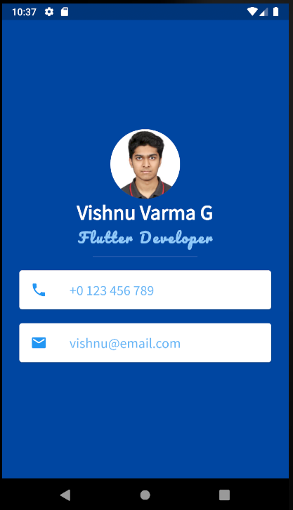

# MyCard

## Our Goal
MyCard is a personal business card. Imagine every time you wanted to give someone your contact details or your business card but you didn't have it on you. Well, now you can get them to download your business card as an app.

## Concepts Learned:

* Stateless Widgets
* Containers to lay out your UI
* Columns and Rows to position your UI elements
* Custom fonts
* Material icons
* Style Text widgets
* Using Flutter Documentation

