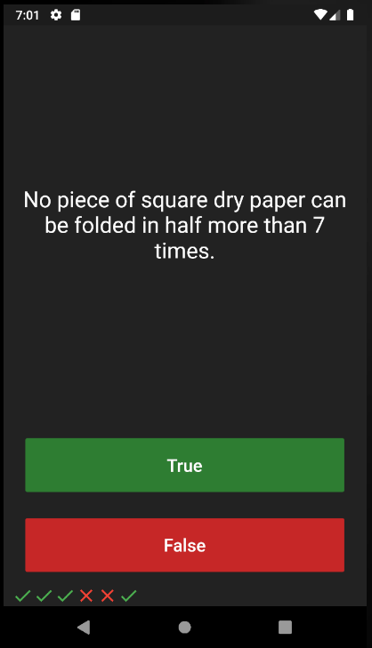
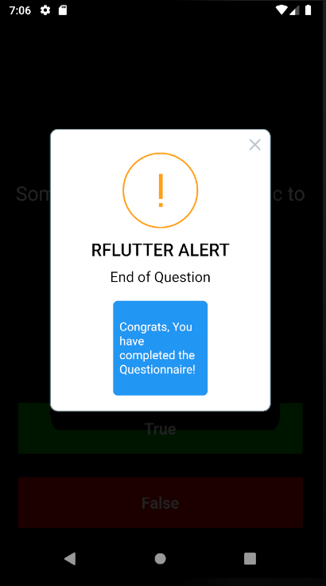

# Quiz Up ❓

## Our Goal

-We’re going to make a quiz app that tests your general knowledge. As one of the most popular types of apps on the app stores, you can create your own quiz for other people to enjoy!

## Concepts Learned:

- Modularising code into separate classes.
- Dart classes and objects.
- Using class constructors.
- Extracting Widgets to refactor your code.
- private and public modifiers in Dart.
- Using Dart lists.
- The difference between var, const and final.

 
