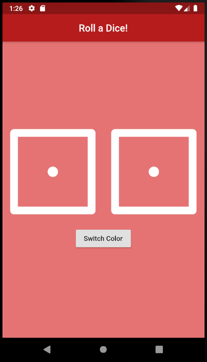

# Dicee 🎲

## Our Goal

A dice app with choice of your theme. You can make the die roll at the press of a button. With this app in your pocket, you’ll be able to settle any score on the go!

## Concepts Learned:

- Flutter stateless widgets to design the user interface.
- Flutter stateful widgets to update the user interface.
- Changing the properties of various widgets.
- onPressed listeners to detect when buttons are pressed.
- Using setState to mark the widget tree as dirty and requiring update on the next render.
- Using Expanded to make widgets adapt to screen dimensions.
- String interpolation.
- Basic dart programming concepts such as data types and functions.

