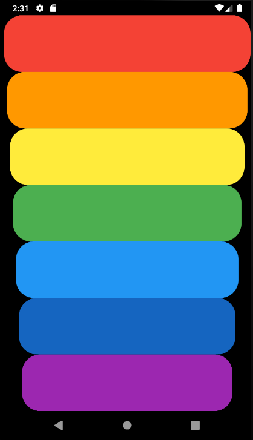

# Xylophone 🎹

## Our Goal

We’re going to make a music app that plays Xylophone sounds. For every Beethoven out there, this will let you unleash your musical talent where ever you are. 

## Concepts Learned:

- Incorporating open source libraries of code into your project using Flutter Packages.
- Playing sound on both iOS and Android.
- Generating repeated user interface Widgets.
- Dart functions that can take input arguments as well as return an output.
- Dart arrow syntax for writing one line functions.

